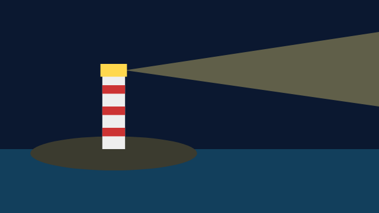
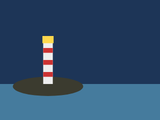
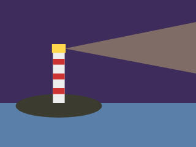
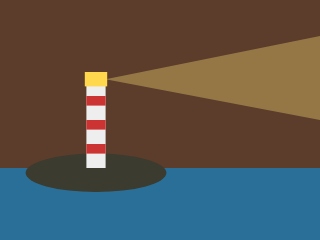

# Farol — exemplo de GDD

# Parte 1 — Visão

## Resumo do jogo

"Farol" é um jogo de quebra-cabeça em que o jogador cuida de um farol numa ilha e guia barcos até o porto com feixes de luz.

**Ficha**

- **Gênero:** Quebra-cabeça
- **Plataformas:** PC e celular
- **Público:** A partir de 10 anos
- **Sessão:** 10 a 20 minutos

### Pilares

- Luz é a única ferramenta: refletir, dividir e bloquear
- → Cada ilha ensina uma ideia nova
- ✓ Sem pressa: nenhum desafio depende de tempo

**? DÚVIDA**

> **Observação:** O modo noturno ainda não tem data.

*Arte da ilha inicial*

## Mecânicas

O feixe sai do farol em linha reta.
Espelhos mudam a direção em 90°; prismas dividem o feixe em dois.

### Peças

- Espelho
- Prisma
#### Peças especiais (a partir da ilha 3)

- ★ Lente: aumenta o alcance
- \! Nuvem: bloqueia o feixe por alguns turnos
Controles no PC: mouse para girar as peças, roda para trocar de peça.

Controles no celular: toque para girar, arrastar para mover.

[▶ O feixe girando (protótipo)](./feixe.webm)

**🔒 SPOILER**

- O final da campanha revela quem acendeu o farol pela primeira vez.

Tom visual: noite azul, luz amarela, traços simples.

Tom sonoro: ondas, vento e um piano calmo.

## Economia

**Loja**

| Item | Preço | Desconto |
| --- | ---: | ---: |
| Espelho dourado | $2,99 | 0% |
| Pacote de ilhas | $4,99 | 10% |
| Tema noturno | $1,99 | 0% |

**Cardápio da loja**

| | |
| :--- | ---: |
| Espelho dourado | $2,99 |
| Pacote de ilhas | $4,99 |
| Tema noturno | $1,99 |

**⚠ ALERTA**

> **Observação:** Os preços seguem a [tabela da loja](#w-6b4c6256-8cd6-4749-86d5-bcf7a8069052).

---

**Antes do lançamento**

- [x] Definir os preços
- [ ] Testar a loja no celular
- [ ] Revisar as [mecânicas](#w-d8c040e8-5dff-4623-adf0-3e0952419cac)

&nbsp;

## Som e galeria

[♪ Tema da ilha (rascunho) · 0:03](./tema-da-ilha.wav)

  

*Ilhas 1 a 3*
